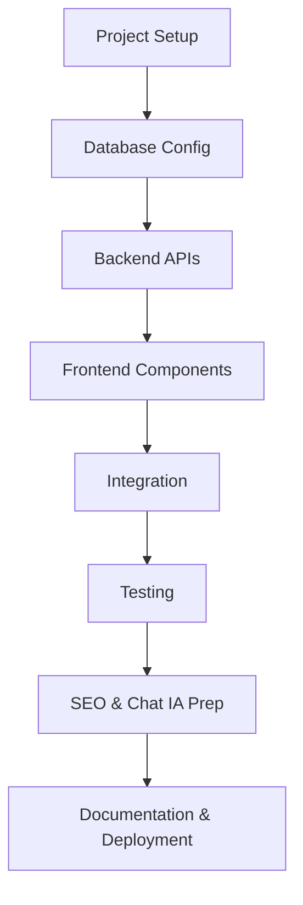

# 🚀 MVP Development Plan for Maxan Sistemas Website

## 🧠 Project Overview
Develop a **minimum viable product (MVP)** web application for **Maxan Sistemas**, combining **B2B services** and **B2C e-commerce**.  
The site will feature a **modern, responsive** design with React frontend, Express backend, and MariaDB database.  

**Slogan:** “Equipos al mejor precio, servicios con la más alta calidad.”

---

## 🧩 Technology Stack
- **Frontend:** React + Vite + TailwindCSS + React Router + React Helmet  
- **Backend:** Node.js + Express + dotenv + CORS + compression + helmet  
- **Database:** MariaDB (using `mysql2/promise`)  
- **Tools (optional):** PM2, nginx, Let's Encrypt, Docker  

---

## 📁 Project Structure
```
maxanSistemas.com/
├── frontend/          
│   ├── src/
│   │   ├── components/
│   │   │   ├── Navbar.jsx
│   │   │   ├── Footer.jsx
│   │   │   ├── ChatWidget.jsx
│   │   ├── pages/
│   │   │   ├── Inicio.jsx
│   │   │   ├── Servicios.jsx
│   │   │   ├── Tienda.jsx
│   │   │   ├── Blog.jsx
│   │   │   ├── Contacto.jsx
│   │   ├── App.jsx
│   │   ├── main.jsx
│   ├── package.json
│   ├── vite.config.js
│   ├── tailwind.config.js
│   └── index.html
├── backend/
│   ├── src/
│   │   ├── routes/
│   │   │   ├── contact.js
│   │   │   ├── products.js
│   │   │   ├── blog.js
│   │   ├── config/
│   │   │   ├── database.js
│   │   ├── app.js
│   │   ├── server.js
│   ├── package.json
│   ├── .env.example
├── database/
│   ├── schema.sql
│   ├── seed.sql
├── README.md
└── docker-compose.yml
```

---

## ⚙️ Detailed Implementation Steps

### 1. Project Setup
- Initialize frontend with Vite + React + TailwindCSS.  
- Initialize backend with Node.js + Express.  
- Install dependencies (`dotenv`, `cors`, `helmet`, `compression`, `mysql2`).  
- Create `.env.example` file for environment variables:
  ```
  DB_HOST=localhost
  DB_USER=root
  DB_PASSWORD=yourpassword
  DB_NAME=maxsysdb
  PORT=5000
  CLIENT_URL=http://localhost:5173
  ```
- Configure CORS dynamically using `CLIENT_URL`.

---

### 2. Database Configuration
- Create MariaDB schema with 3 tables:
  - `contacts(id, nombre, email, telefono, mensaje, fecha TIMESTAMP DEFAULT CURRENT_TIMESTAMP)`
  - `products(id, nombre, categoria, descripcion, precio, imagenURL)`
  - `blog(id, titulo, contenido, fechaPublicacion)`
- Seed initial data for products and blog articles.
- Store SQL in `/database/schema.sql` and `/database/seed.sql`.

---

### 3. Backend Development
- Implement Express server with middlewares:
  - `helmet()` for security headers
  - `compression()` for gzip
  - `express.json()` for parsing
  - `cors()` restricted to `CLIENT_URL`
- API routes:
  - **POST** `/api/contact`: Save contact form data.
  - **GET** `/api/products`: Retrieve product list.
  - **GET** `/api/blog`: Retrieve blog posts.
- Add input validation and error handling.  
- Prepare structure for future automation (n8n webhook or AI integration).

---

### 4. Frontend Development
- Create shared layout components:
  - `Navbar` (logo + links)
  - `Footer` (contact info + social links)
  - `ChatWidget` (WhatsApp floating button with placeholder for future n8n/AI integration)
- Implement page components:
  - `Inicio`: Hero section (slogan, CTA buttons)
  - `Servicios`: List 5 services with descriptions and mini-slogans.
  - `Tienda`: Product grid with “Cotizar” buttons.
  - `Blog`: Render sample articles dynamically.
  - `Contacto`: Form connected to `/api/contact`.
- Add SEO meta tags per page with **React Helmet**.
- Ensure responsive design using TailwindCSS utilities.

---

### 5. Integration and Testing
- Connect frontend to backend APIs using Axios or Fetch.  
- Test:
  - Form submissions (Contact page).  
  - Product listing (Tienda).  
  - Blog rendering (Blog).  
  - Chat widget behavior.  
- Validate responsiveness on mobile, tablet, and desktop.  

---

### 6. Documentation and Deployment
- Create **README.md** with setup and deployment instructions.  
- Prepare **Ubuntu deployment**:
  - Install Node.js 18+, npm, and MariaDB 10.6+.  
  - Configure firewall (UFW for ports 80, 443, 5000).  
  - Setup SSL with Let's Encrypt.  
- Build frontend (`npm run build`) and serve static files from Express.  
- Use **PM2** for process management and **nginx** as reverse proxy.  

---

## 🎨 Color Scheme
- **Primary:** #0f172a (Blue Dark)  
- **Secondary:** #16a34a (Green)  
- **Neutral:** #FFFFFF (White)

---

## 🌟 Key Features
- Responsive, corporate-style design.  
- Functional contact form (backend-integrated).  
- Dynamic product and blog listings.  
- WhatsApp chat widget (expandable to n8n/AI).  
- Basic SEO setup (React Helmet + meta tags).  
- Secure backend with environment variables and helmet.  

---

## ☁️ Deployment Considerations
- **Server Requirements:** Ubuntu 20.04+, Node.js 18+, MariaDB 10.6+.  
- **Environment Setup:**  
  - Use `.env` for all sensitive data.  
  - Create production DB and user.  
  - Apply schema and seed data.  
- **Security:**  
  - Enable HTTPS via Let’s Encrypt.  
  - Rate-limit API endpoints.  
  - Sanitize all inputs.  
- **Performance:**  
  - Gzip compression, caching headers, image optimization.  
  - Monitor with PM2 logs.  
- **Backup:**  
  - Automated database dumps.  
  - Log rotation.  
  - Monitoring & alerting tools.

---

## 📈 Workflow Diagram


